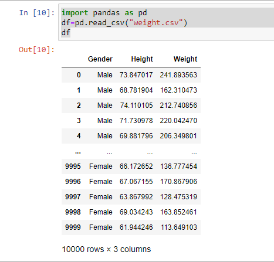
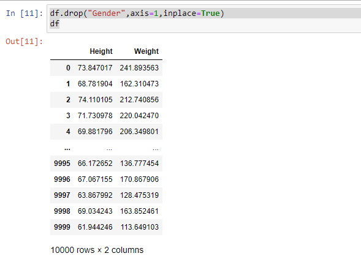
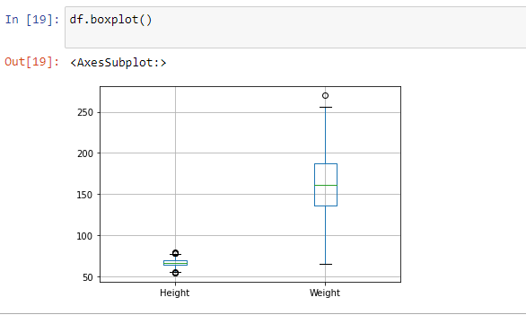
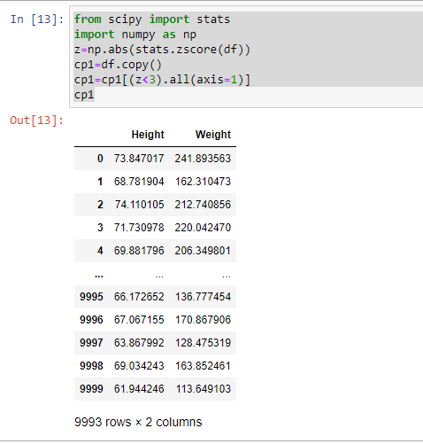
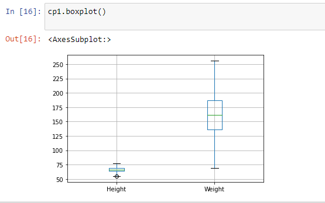
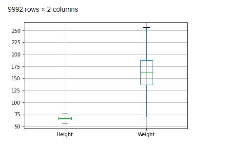

# Ex-02_DS_Outlier


## AIM
To read the given data and check the outliers and to remove them

# ALGORITHM
### STEP 1
Read the given Data
### STEP 2
Convert the data into a data frame by importing pandas
### STEP 3
Study the outliers and remove the unnecessary data columns 
### STEP 4
Import numpy and from scipy import stats to find the z-score
### STEP 5 
Set the range for z-score and find IQR
### STEP 6
Plot the results


# CODE

```
import pandas as pd
df=pd.read_csv("weight.csv")
df

df.drop("Gender",axis=1,inplace=True)
df

df.boxplot()
df

from scipy import stats
import numpy as np
z=np.abs(stats.zscore(df))
cp1=df.copy()
cp1=cp1[(z<3).all(axis=1)]
cp1

cp1.boxplot()

cp2=df.copy()
a=cp2.quantile(0.25)
b=cp2.quantile(0.75)
IQR=b-a
cp2_new=cp2[((cp2>=a-1.5*IQR)&(cp2<=b+1.5*IQR)).all(axis=1)]
cp2_new.boxplot()
cp2_new
```

# OUTPUT


















# RESULT
Thus the outiers has been successfully removed from the data frame.